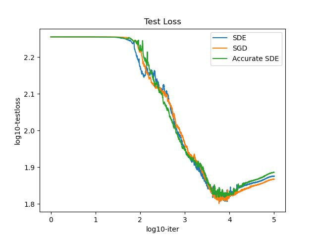

# Implicit Bias of SGD 

for Diagonal Linear Networks: a Provable Benefit of stochasticity

Reimplementations and some further experiments of https://arxiv.org/pdf/2106.09524.pdf 

### The effect of L0 Norm of beta

**Convergence**

1. uniformly gaussian, $\gamma=0.025$, $||\beta||_0=20$


**Comparison**

2. Comparison of SGD, SDE, Accurate SDE,  $\gamma=0.025$, $||\beta||_0=20$, uniformly, $scale=1$ (10 times average)


3. Comparison of SGD, SDE, Accurate SDE,  $\gamma=0.0007$, $||\beta||_0=20$, nonuniformly, $start=0.1$, $end=10$ (10times average)




### Some Commands 

```python
## Change the Scale of data

python Simu_av_compare.py --distri uniformly --gamma 0.1 --uni_scale 1 --multi 10

python Simu_av_compare.py --distri nonuniformly --gamma 0.0025 --non_uni_start 0.1 --non_uni_scale 10 --multi 10
```

```python 
## Change the L0 Norm of beta

python Simu_av_compare.py --distri uniformly --gamma 0.08 --uni_scale 1 --multi 10 --L0norm 20

python Simu_av_compare.py --distri nonuniformly --gamma 0.00005 --non_uni_start 0.1 --non_uni_scale 10 --multi 10 --L0norm 20
```


